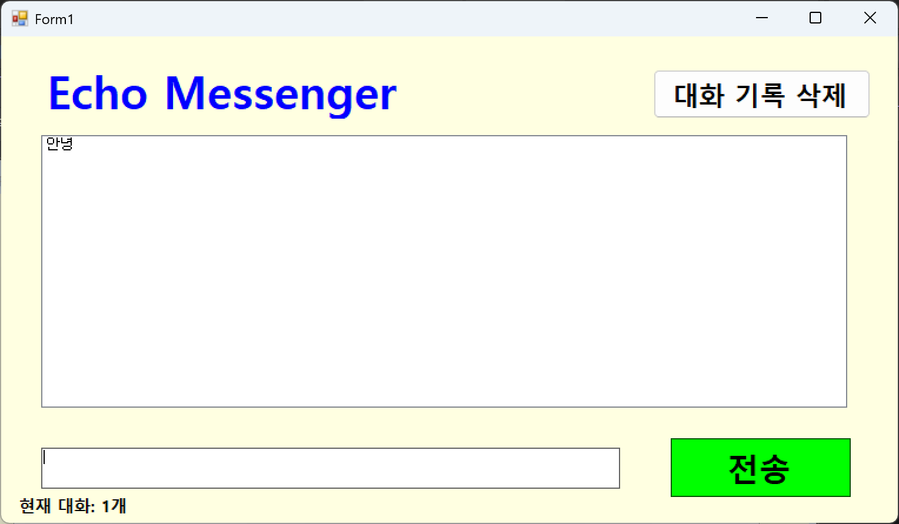
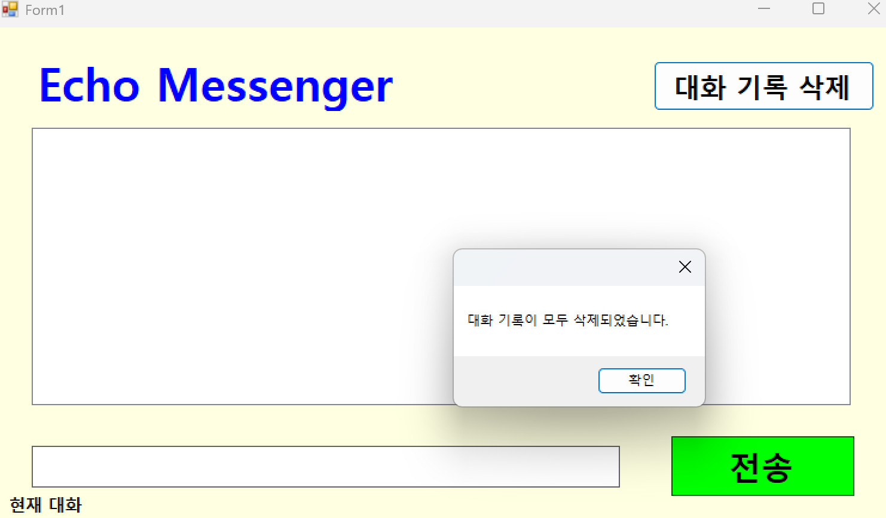

# (C# 코딩) 에코 메신저

## 개요
- C# 프로그래밍 학습
- 1줄 소개: 사용자의 키보드 입력을 실시간으로 받아 리스트 형식으로 출력하고, 데이터 가공 및 관리 기능을 제공하는 Windows Forms 기반 메신저 앱입니다.
- 사용한 플랫폼:
  - C#, .NET Windows Forms, Visual Studio 2022, GitHub
- 사용한 컨트롤:
  - Label(제목 및 상태 표시), TextBox(메시지 입력), ListBox(대화 기록 출력), Button(전송 및 관리), Delete(대화 기록 삭제)
- 사용한 기술과 구현한 기능:
  - 문자열 처리 기술: `string.Trim()`을 이용한 공백 제거, `string.IsNullOrWhiteSpace()`를 활용한 유효성 검사, 보간 문자열(`$""`)을 이용한 데이터 결합 기능을 구현했습니다.
  - 데이터 및 시간 관리: `DateTime.Now`를 활용한 실시간 타임스탬프 생성과 `ListBox.Items.Count`를 이용한 동적 데이터 카운팅 기능을 적용했습니다.
  - 사용자 경험(UX) 개선: `Focus()`, `Clear()` 메소드와 `KeyDown` 이벤트 핸들링을 통해 마우스 없이 키보드만으로 조작 가능한 인터페이스를 구축했습니다.
  - 예외 처리 및 방어 코드: 데이터 삭제 시 인덱스 미선택 에러를 방지하고, `MaxLength` 속성을 통한 입력 글자 수 제한 등 시스템 안정성을 고려했습니다.

---

## 실행 화면 (과제1)
- 과제1 코드의 실행 스크린샷

- 과제 내용
  - 사용자 인터페이스(UI) 설계를 위해 필수 컨트롤인 Label, TextBox, Button, ListBox를 윈도우 폼 위에 유기적으로 배치하였습니다.
  - 입력창(TextBox)에 적힌 문자열을 버튼 클릭 시 대화창(ListBox)의 새로운 아이템으로 등록하는 전송 프로세스를 구축하였습니다.
  - 데이터 전송 작업이 수행된 직후, 입력 필드를 즉시 초기화하여 사용자가 끊김 없이 다음 메시지를 작성할 수 있는 환경을 조성하였습니다.

- 구현 내용과 기능 설명
  - UI 레이아웃 설계: 사용자가 직관적으로 메시지를 입력하고 확인할 수 있도록 상단에는 앱 제목을 배치하고 중앙에는 대화 리스트를, 하단에는 입력창과 전송 버튼을 균형 있게 배치했습니다.
  - 기본 전송 로직: 전송 버튼 클릭 이벤트를 통해 `TextBox.Text`의 값을 변수에 저장하고, `ListBox.Items.Add()`를 호출하여 화면에 즉각적으로 반영되도록 구현했습니다.
  - 입력창 초기화: 메시지가 성공적으로 리스트에 추가된 후, `txtInput.Clear()`를 호출하여 다음 메시지 입력을 위한 대기 상태를 자동으로 만들었습니다.

---

## 실행 화면 (과제2)
- 과제2 코드의 실행 스크린샷

- 과제 내용
  - 전송이 끝나면 입력창에 남겨진 기존 메시지를 삭제하고, 자동으로 입력 포커스를 둡니다.
  - 마우스 클릭 대신 키보드의 Enter 키를 눌러도 메시지가 전송되도록 합니다.
  - 내용이 없는 빈 문자열이나 공백(Space)만 있을 때는 메시지가 전송되지 않도록 방지합니다.

- 구현 내용과 기능 설명
  - 포커스 제어: `txtInput.Focus()` 메소드를 활용하여 전송 후 마우스를 다시 클릭할 필요 없이 즉시 타이핑이 가능하도록 UX를 최적화했습니다.
  - 엔터키 이벤트: `KeyDown` 이벤트를 등록하여 엔터 키가 눌렸을 때 전송 버튼의 클릭 로직을 대행하도록 설정함으로써 조작 편의성을 높였습니다.
  - 방어적 프로그래밍: `string.IsNullOrWhiteSpace()` 조건문을 추가하여, 사용자가 실수로 공백만 입력하거나 빈 칸인 상태로 전송했을 때 무의미한 데이터가 리스트에 추가되는 것을 원천 차단했습니다.

---

## 실행 화면 (과제3)
- 과제3 코드의 실행 스크린샷

- 과제 내용
  - 메시지 앞에 현재 시간([14:20:05])을 자동으로 결합하여 리스트에 출력합니다.
  - 현재 리스트에 쌓인 총 메시지 개수를 계산하여 하단 Label에 실시간으로 업데이트합니다.
  - 사용자가 입력한 메시지의 앞뒤 불필요한 공백을 Trim() 함수로 제거하여 저장합니다.

- 구현 내용과 기능 설명
  - 타임스탬프 결합: `DateTime.Now`를 원하는 포맷(`HH:mm:ss`)으로 변환하고 문자열 보간법을 사용하여 메시지와 결합함으로써 채팅의 기록성을 확보했습니다.
  - 실시간 카운팅: 리스트에 항목이 추가되거나 삭제될 때마다 `Items.Count` 값을 하단 라벨에 업데이트하여 사용자가 현재 대화량을 한눈에 파악할 수 있게 설계했습니다.
  - 공백 정제: `Trim()` 메소드를 적용하여 사용자가 입력한 메시지 전후의 불필요한 공백을 제거함으로써 데이터 저장 공간의 효율성과 출력의 깔끔함을 동시에 챙겼습니다.

---

## 실행 화면 (과제4)
- 과제4 코드의 실행 스크린샷

- 과제 내용
  - ListBox에서 특정 메시지를 클릭하고 '삭제' 버튼을 누르면 해당 항목만 목록에서 제거합니다. (예외 처리 포함)
  - '대화 기록 삭제' 버튼을 클릭하면 리스트의 모든 내용을 한 번에 지웁니다.
  - 입력창에 글자 수를 50자로 제한하고, 초과 시 경고 메시지를 띄우거나 전송을 차단합니다.

- 구현 내용과 기능 설명
  - 항목 삭제 및 예외 처리: `SelectedIndex`가 -1인 경우를 조건문으로 걸러내어, 항목을 선택하지 않고 삭제 버튼을 눌렀을 때 프로그램이 비정상 종료되는 것을 방지했습니다.
  - 전체 초기화 기능: `Items.Clear()` 기능을 통해 전체 대화 내역을 한 번에 비울 수 있는 기능을 추가하여 데이터 관리 기능을 강화했습니다.
  - 입력 길이 제한: TextBox의 `MaxLength` 속성을 50으로 설정하여 물리적으로 입력을 제한하거나, 코드 레벨에서 50자 초과 여부를 체크해 사용자에게 `MessageBox`로 알림을 주는 로직을 구현했습니다.

---
